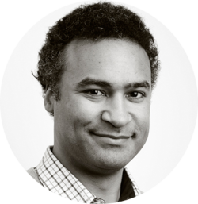

# Key questions:

>"I'm particularly interested in how we can use this type of device and data to track respiratory disease (such as CoViD-19) in the population.

>One idea we are keen to test the viability of identifying signals of respiratory illness and their precursors. The heart and lungs are part of the machinery which is responsible getting oxygen around your body, under your normal baseline activity levels, like taking a walk your lungs will get oxygen into your body and your heart will have to work at your normal level to do this. However, when you have a respiratory infection your lungs don't work as well and consequently for the same level of activity, your heart will have to work harder. So by having an record of your baseline heart rates for a given activity levels when healthy, and your heart rates for the equivalent activity levels when ill, we are looking for a difference in the activity:heart rate ratios. Fortunately, this data is exactly what a wearable device like Fitbit provides. This is something of a simplification, but is broadly captures the idea.

>By studying data from a lot of people we hope to identify subtle differences, especially if wide testing for CoViD-19 comes into place - it will be interesting to see if we can differentiate other respiratory infections from CoViD-19"

 -- Dr Amos Folarin

   

>"Both the Covid-19 outbreak itself and the social measures required to contain the spread are unprecedented in our lives. I'm interested in what impact it is having on our psychological well-being, and what we can do to limit any negative impacts and who might be most at risk of them. For example, we know that regular exercise and being in nature can reduce stress, anxiety, and depression. Now that there are limits on our freedom to go outside, is the permission to exercise once per day afforded to people in some countries used, useful, adequate or inessential? How long are people able to socially isolate before any ill effects emerge?"

-- Callum Stewart  
