# How to Register

## Registration process:

### 1. Download & install the Mass Science app

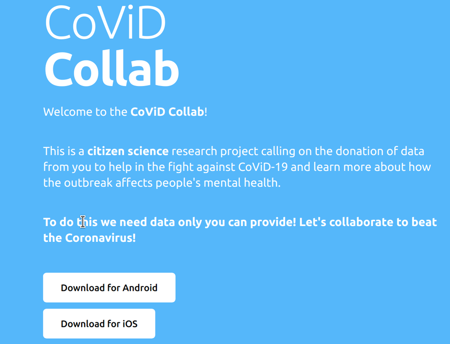

### 2. Enrol in the study
Select "Enrol Now", read the study information carefully, there's a summary of the key points.

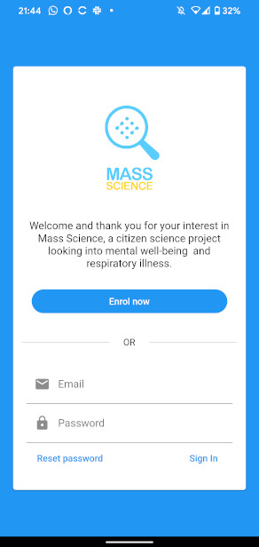
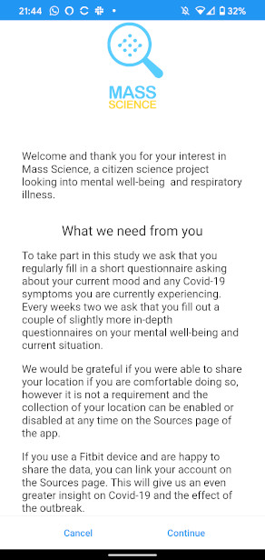
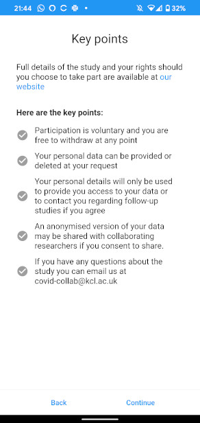

### 3. Consent
If you wish to participate, please read and tick the consent checkboxes.

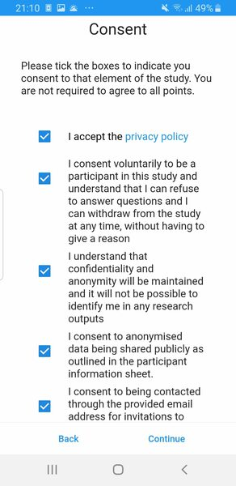

### 4. Register
Registration here creates your account. You'll need an email address for this step.

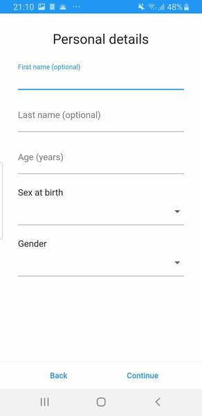

#### Approve permissions to collect location Data
If you are willing to share location data this should be enabled here. Note you'll also need to enable the location option in Step 6 (see below after registration is complete)

### 5. You may immediately fill the CoViD-19 Symptoms & Diagnosis questionnaires
While you will be reminded to fill these with notifications, you may fill them at anytime you experience symptoms or receive a diagnosis - you do not need to wait for the notification if you are experiencing symptoms or receive a diagnosis of COVID-19.

Home screen:

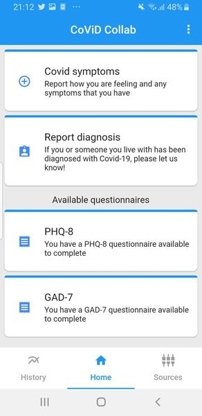

The Symptoms questionnaire:

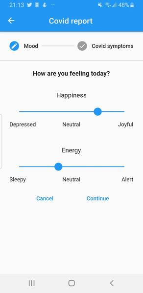
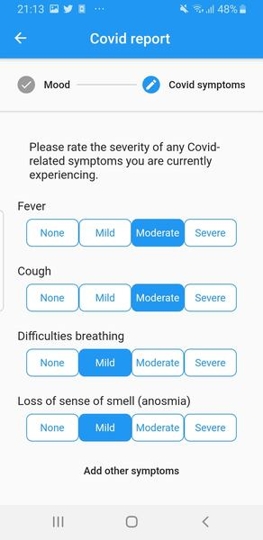
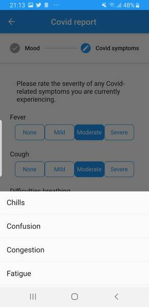

The Diagnosis questionnaire:

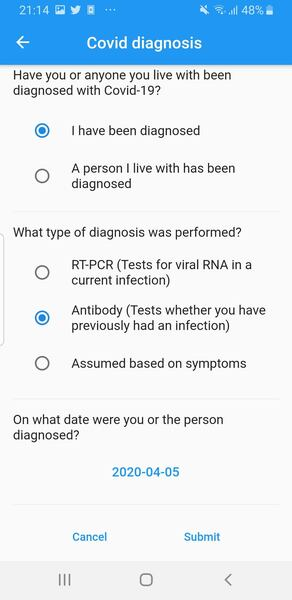

#### When you receive your notifications please click on them to fill out the questionnaires

When you fill a questionnaire (PHQ8, GAD-7) our app will automatically schedule a new notification in 2 weeks time. You should fill these questionnaires based on your experiences in the last 2 weeks.

The PHQ8 and GAD7 questionnaires:

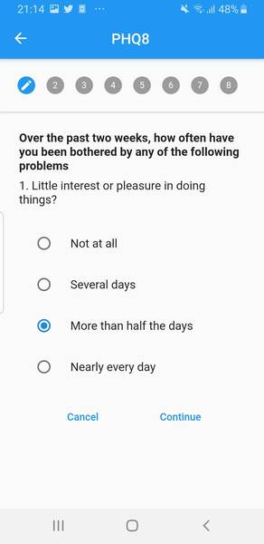
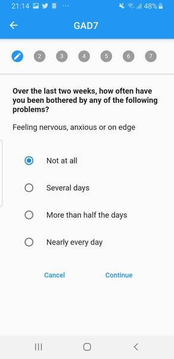

You will also receive notifications for CoViD-19 Symptoms & Diagnosis questionnaires.

### 6. Phone location data
This screen displays and controls the Data Sources (location and Fitbit) you have enabled:

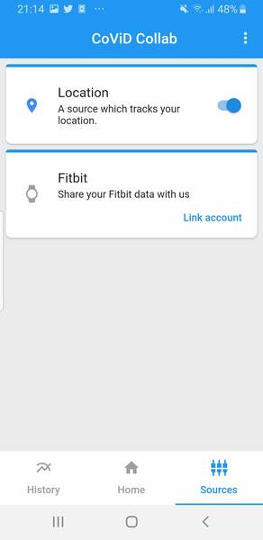

If you want to later provide Covid Collab with location data permission, you may do so.

### 7. Provide Covid Collab with access to your Fitbit data
Click on "Link account" to provide Covid Collab with your Fitbit data, you'll need to login to your Fitbit account once (don't worry this login is with Fitbit and is not visible to us, it indicates to Fitbit that you give use permission to collect the Fitbit data), this permission may be withdrawn at anytime you desire.

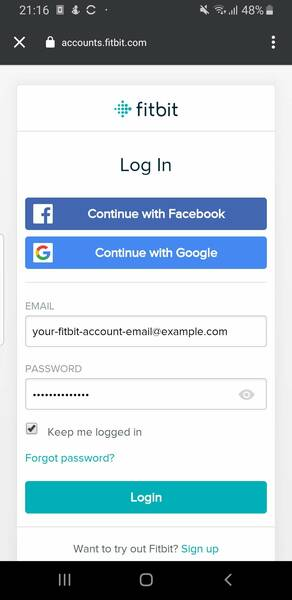
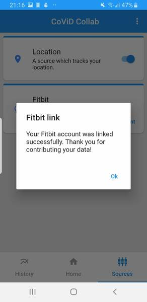

### 8. View history of the responses in the Symptoms questionnaire
WE EMPHASIZE THAT THIS NOT A CLINICAL APPLICATION AND SHOULD IN NO WAY BE CONSIDERED A CLINICAL DIAGNOSIS!
This screen is purely for your reference based on the answers you provided to us.
The Happiness/Energy scale is based on this [paper](https://www.ncbi.nlm.nih.gov/pmc/articles/PMC2367156/).

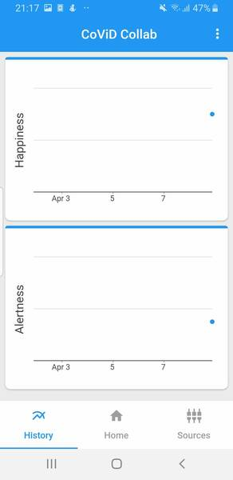

### 9. You may Logout or Withdraw from the study
If you want to "Logout" to pause data collection, or transfer to a new phone you may do so from this menu. If you wish to leave the study then you may select the "Leave Study" option.

